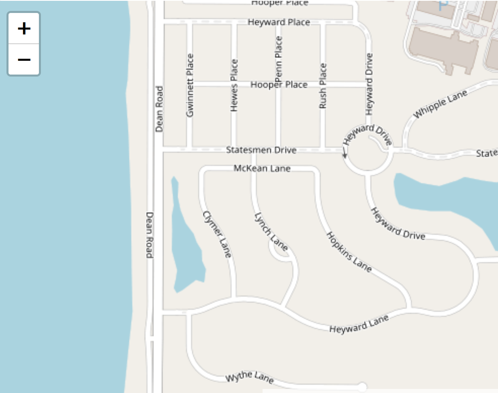

# AgentMaps - Social Simulations on Interactive Maps

AgentMaps is a Javascript library for building and visualizing dynamic social systems on maps.
It is based on the [Leaflet](https://leafletjs.com/) interactive mapping [library](https://github.com/Leaflet/Leaflet).
Given a neighborhood, AgentMaps lets you quickly and easily:

* Build units along the streets.
* Spawn agents onto the map.
* Schedule them to move between places on the map.
* Change their appearance and properties.

AgentMaps lets you turn this:

into something like this:

### Documentation

Docs for people who want to use AgentMaps are available [here](https://noncomputable.github.io/AgentMaps/docs/index.html).

Docs people who want to understand its internals are [here](https://noncomputable.github.io/AgentMaps/devdocs/index.html).

A basic walkthrough for creating an AgentMaps simulation can be found [here](https://noncomputable.github.io/AgentMaps/docs/tutorial-quickstart.html). 

### Demos

[Simple](https://noncomputable.github.io/AgentMaps/demos/simple/simple.html): Demonstrates all the different ways agents can travel around a map.

[Epidemic](https://noncomputable.github.io/AgentMaps/demos/epidemic/epidemic.html): Agents commute between different parts of a neighborhood while an infection spreads between them.

You can find the corresponding code under _/demos_ in the gh-pages branch [here](https://github.com/noncomputable/AgentMaps/tree/gh-pages/demos).

### Authors

* Andrew - came up with & built AgentMaps

### Acknowledgements

I've only had a few extended conversations talking and thinking about this project outloud over the last few months, and those probably influenced how I went forward with it. The people I've had those discussions with are:

* I. ("Wheels") Errati
* M. ("dont ask me, ask gagan") Singh

Thank you to anyone who somehow benefits from this.
